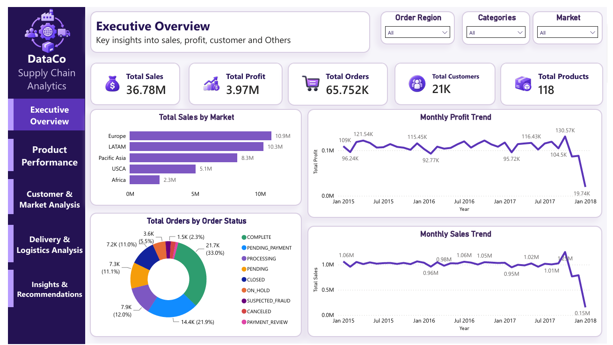
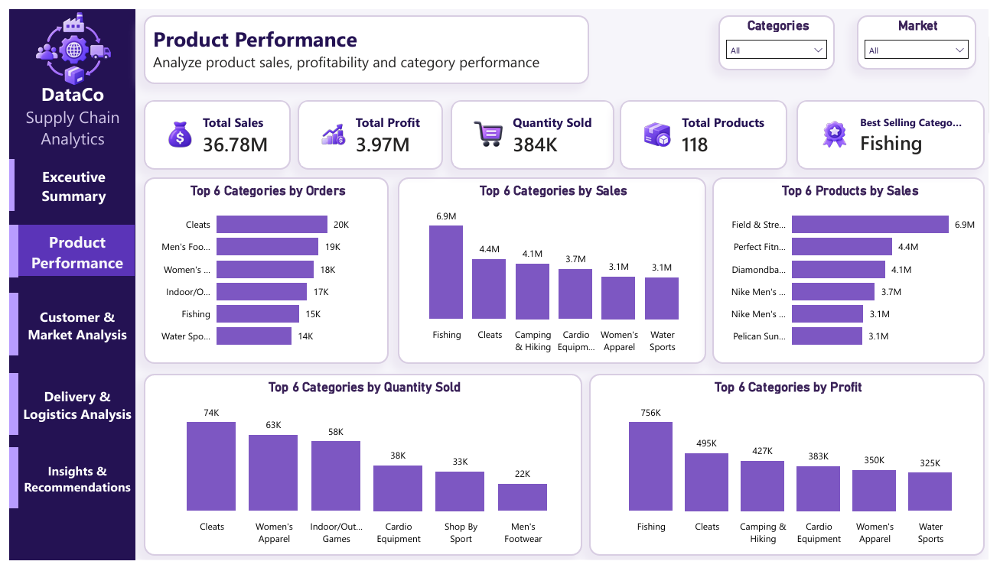
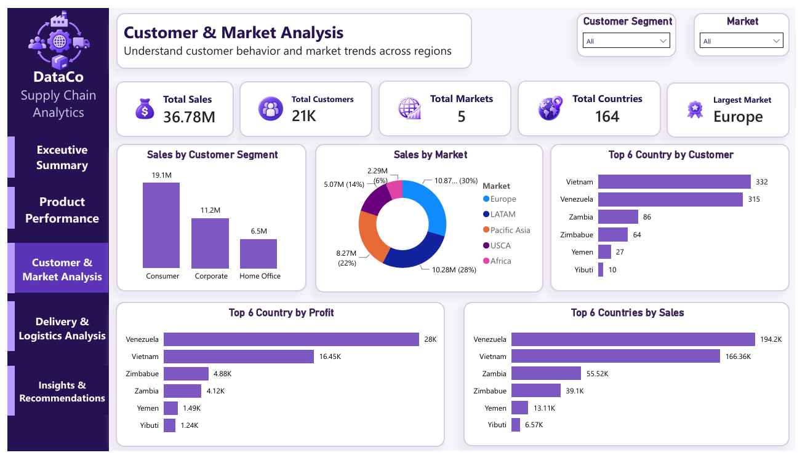
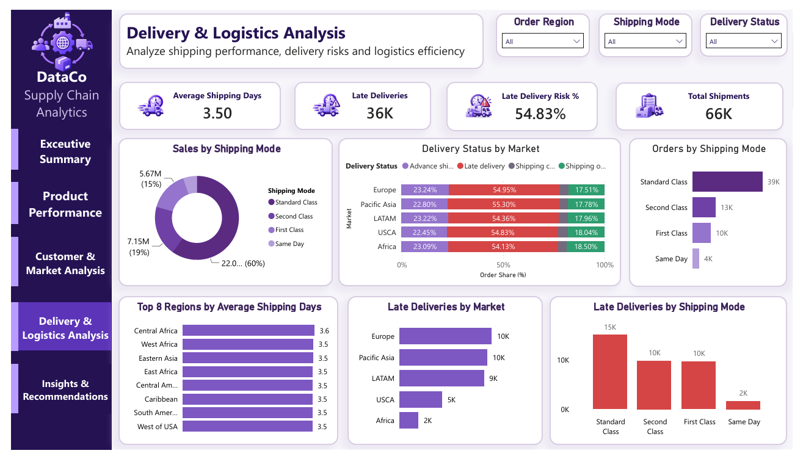
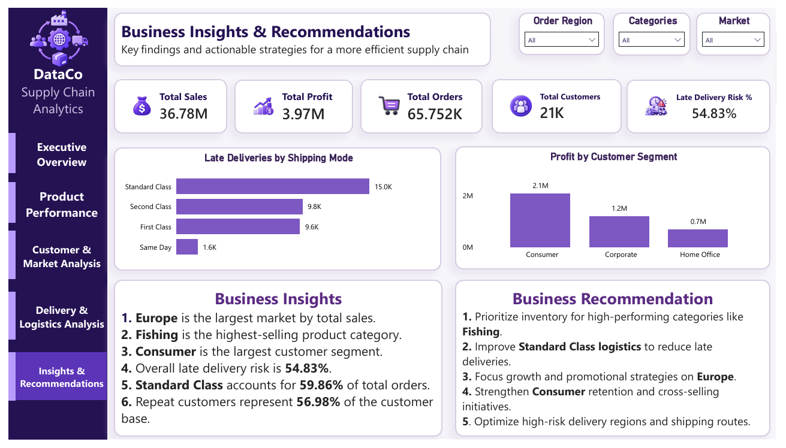

# DataCo Smart Supply Chain Analytics

> End-to-End Data Analysis & Business Intelligence Project using Python, MySQL & Power BI


An end-to-end data analytics and business intelligence case study on DataCo Global's supply chain operations, covering **$36.78M** in sales across **65,752 orders**, **20,652 customers** and **164 countries**. The project moves raw transactional data through Python cleaning and exploratory data analysis, SQL-based business analysis and validation, and a five-page Power BI dashboard — concluding with evidence-based business recommendations covering revenue, profitability, product concentration, customer retention and delivery risk.

---
## 📊 Project Highlights

| Metric | Value |
|---|---:|
| 💰 Total Sales | **$36.78M** |
| 📈 Total Profit | **$3.97M** |
| 🛒 Total Orders | **65,752** |
| 👥 Total Customers | **20,652** |
| 📦 Total Products | **118** |
| 🚚 Late Delivery Risk | **54.83%** |


## Table of Contents

- [Project Highlights](#-project-highlights)
- [Overview](#overview)
- [Business Problem](#business-problem)
- [Business Objectives](#business-objectives)
- [Dataset](#dataset)
- [Tech Stack](#tech-stack)
- [Analytical Workflow](#analytical-workflow)
- [Python Analysis](#python-analysis)
- [SQL Analysis](#sql-analysis)
- [Power BI Dashboard](#power-bi-dashboard)
- [Key KPIs](#key-kpis)
- [Key Business Insights](#key-business-insights)
- [Analytical Considerations](#analytical-considerations)
- [Business Recommendations](#business-recommendations)
- [Repository Structure](#repository-structure)
- [How to Run](#how-to-run)
- [Skills Demonstrated](#skills-demonstrated)
- [Conclusion](#conclusion)
- [Author](#author)

---

## Overview

This project analyzes DataCo Global order-item-level transactional data to build a decision-support view of supply chain performance. The analysis spans sales, profitability, products, categories, customers, customer segments, markets, countries, regions, shipping modes and delivery performance.

**The dataset is order-item level.** Each row represents a single product line item within an order, so an order containing three products appears as three rows sharing the same `Order Id`. All order-level KPIs therefore use **DISTINCT `Order Id`** logic rather than simple row counts, and customer and product counts use distinct `Customer Id` and `Product Card Id` respectively. Treating rows as orders would materially overstate order volume and distort average order value.

The project is structured to answer a practical question set for supply chain, commercial and logistics stakeholders: where revenue and profit are generated, where sales volume fails to convert into profitability, and which operational patterns are associated with delivery risk.

---

## Business Problem

DataCo Global operates across five global markets and ships tens of thousands of orders per year. Two questions sit at the center of this analysis:

**1. Where is the business generating revenue and profit, and where are sales not translating into profitability?**
The dataset shows an overall profit margin of 10.78%, providing a baseline for evaluating category, product, and market-level profitability, so understanding which categories, products, segments and markets convert revenue into profit — and which do not — matters directly for **pricing, discount policy, product strategy and inventory prioritization**.

**2. What patterns are associated with late-delivery risk across shipping modes, markets, categories and regions?**
A majority of order items in this dataset carry late-delivery risk. Identifying where that risk concentrates informs **logistics operations, fulfillment planning and service quality**, and determines whether corrective action should be targeted geographically or by shipping process.

Without this structured view, decisions on inventory, market investment and customer retention rely on intuition rather than evidence.

---

## Business Objectives

- Quantify overall sales, profit, order and quantity performance using correct distinct-count logic
- Analyze product and category performance across sales, profit, quantity and margin
- Identify high-sales but low-profitability areas through a profitability matrix
- Analyze customer segments, repeat-purchase behaviour and repeat customer rate
- Measure customer and product revenue concentration via Pareto analysis
- Compare market, country and regional performance
- Analyze shipping-mode usage and average shipping duration
- Quantify late-delivery risk and evaluate its distribution across operational dimensions
- Validate all Python metrics against SQL and Power BI outputs
- Translate findings into actionable, evidence-based business recommendations

---

## Dataset

| Attribute | Detail |
|---|---|
| Records | 180,519 rows (order line items) |
| Columns | 53 |
| Date coverage | 2015 – January 2018 |
| Geographic coverage | 164 countries, 23 regions, 5 markets |
| Distinct orders | 65,752 |
| Distinct products | 118 |

The dataset contains fields relating to **customer, product, order, sales, profit, discount, market, region, country, shipping, delivery and date** dimensions.

**Data sensitivity note:** the raw source includes customer-identifying and address-related fields. This dataset is **not anonymized**. The analysis notebook therefore uses safe analytical column previews, restricts descriptive statistics to non-sensitive fields, and drops identifying columns during cleaning so no downstream output can render personal data.

---

## Tech Stack

| Tool | Purpose |
|------|---------|
| Python | Data cleaning, preprocessing, EDA, advanced analysis |
| Pandas | Data manipulation and aggregation |
| NumPy | Numerical analysis |
| Matplotlib | Statistical and business visualizations |
| Seaborn | Exploratory data analysis visualizations |
| Plotly | Interactive analytical visualizations |
| MySQL | Structured business analysis and metric validation |
| Power BI | Data modeling, DAX, interactive dashboarding |
| Jupyter Notebook | Analytical documentation and reproducibility |

---

## Analytical Workflow

```
Raw CSV Dataset
      ↓
Data Quality Assessment      →  missing values, duplicates, cardinality, validity checks
      ↓
Data Cleaning & Preprocessing →  date parsing, redundant/PII column removal, standardization
      ↓
Feature Engineering           →  date parts, margin, shipping delay, repeat-customer flags
      ↓
Exploratory Data Analysis     →  performance, products, customers, markets, logistics
      ↓
Advanced Business Analysis    →  Pareto, volume vs. profitability, sales vs. delivery risk
      ↓
SQL Business Analysis         →  structured querying and cross-validation in MySQL
      ↓
Power BI Data Modeling        →  star schema, relationships, DAX measures
      ↓
Interactive Dashboard         →  five-page reporting layer with slicers and navigation
      ↓
Business Insights & Recommendations
```

---

##  Python Analysis

Python was used for data cleaning, exploratory data analysis, feature engineering, and business-focused analysis.

Key areas:
- Data quality assessment and preprocessing
- Sales and profit analysis
- Time-series analysis
- Product and category performance
- Customer and market analysis
- Geographic analysis
- Shipping and delivery analysis
- Pareto / 80-20 analysis
- Volume vs. profitability analysis
- Sales vs. delivery-risk analysis

---

##  SQL Analysis

MySQL was used to validate the dataset and perform structured business analysis.

Key areas:
- Sales and profitability analysis
- Product performance
- Customer analysis
- Market and country analysis
- Repeat-customer analysis
- Delivery and logistics analysis
- Shipping-mode analysis
- Trend and growth analysis
- Pareto and concentration analysis
---

## Power BI Dashboard

A five-page report built on a **star schema** data model: a central `FactSales` table related to `DimCustomer`, `DimProduct`, `DimDate`, `DimMarket`, `DimRegion` and `DimCountry`, with a dedicated `Measure` table holding all DAX measures. Each page carries consistent branding, button-based page navigation and contextual slicers.

### 1. Executive Overview

Company-level performance at a glance.
- **KPIs:** Total Sales, Total Profit, Total Orders, Total Customers, Total Products
- **Visuals:** Monthly Sales Trend (line), Monthly Profit Trend (line), clustered bar and donut composition charts
- **Slicers:** Market, Categories, Order Region

### 2. Product Performance

Product and category sales and profitability.
- **KPIs:** Total Sales, Total Profit, Quantity Sold, Total Products, Best Selling Category
- **Visuals:** Top 6 Categories by Sales, Top 6 Categories by Profit, Top 6 Categories by Quantity Sold, Top 6 Categories by Orders, Top 6 Products by Sales
- **Slicers:** Market, Categories

### 3. Customer & Market Analysis

Customer behaviour and geographic performance.
- **KPIs:** Total Sales, Total Customers, Total Countries, Total Markets, Largest Market
- **Visuals:** Sales by Customer Segment, Sales by Market (donut), Top 6 Countries by Sales, Top 6 Country by Profit, Top 6 Country by Customer
- **Slicers:** Market, Customer Segment

### 4. Delivery & Logistics Analysis

Shipping performance and delivery risk.
- **KPIs:** Late Deliveries, Total Shipments, Late Delivery Risk %, Average Shipping Days
- **Visuals:** Sales by Shipping Mode (donut), Orders by Shipping Mode, Late Deliveries by Market, Late Deliveries by Shipping Mode, Delivery Status by Market (100% stacked bar), Top 8 Regions by Average Shipping Days
- **Slicers:** Delivery Status, Shipping Mode, Order Region

### 5. Business Insights & Recommendations

Converts analytical findings into business-oriented insights and recommended actions.
- **KPIs:** Total Sales, Total Profit, Total Orders, Total Customers, Late Delivery Risk %
- **Visuals:** Profit by Customer Segment, supporting ranking chart, and structured insight and recommendation panels
- **Slicers:** Market, Categories, Order Region

---

## Key KPIs

| KPI | Value |
|---|---:|
| Total Sales | $36.78M |
| Total Profit | $3.97M |
| Profit Margin | 10.78% |
| Total Orders | 65,752 |
| Total Customers | 20,652 |
| Total Products | 118 |
| Quantity Sold | 384,079 |
| Average Order Value | $559.45 |
| Average Shipping Days | 3.50 |
| Late Delivery Risk | 54.83% |
| Repeat Customer Rate | 56.98% |
| Standard Class Order Share | 59.86% |

All twelve metrics were independently calculated in Python and reconciled against the Power BI model within defined tolerances.

---

## Key Business Insights

**1. Overall profitability baseline.** The dataset generates $36.78M in sales and $3.97M in profit at an overall profit margin of 10.78%, providing a baseline for evaluating profitability across products, categories, segments and markets.
*Business implication:* Profitability should be evaluated alongside revenue and volume to identify areas where stronger sales do not necessarily translate into stronger margins.

**2. Majority late-delivery risk.** 54.83% of order items carry late-delivery risk.
*Business implication:* The observed level of late-delivery risk highlights delivery performance as an important area for operational review.

**3. Late-delivery rates differ substantially across shipping modes, while market-level differences are comparatively smaller in this dataset.** Late rates remain relatively consistent across markets, regions and categories, but vary substantially by shipping mode. Standard Class shows the lowest late-delivery rate and the closest alignment between scheduled and actual shipping days.
*Business implication:* Shipping-mode scheduling and service-level practices should be reviewed to understand the observed differences in late-delivery rates.

**4. Concentrated product revenue.** Approximately the top 8 of 118 products account for around 80% of total sales, with the single largest product contributing close to a fifth of company-wide revenue.
*Business implication:* Disruption affecting a small group of SKUs could have a disproportionate revenue impact, warranting priority inventory buffering and supplier redundancy.

**5. Sales leadership does not equal profit leadership.** Fishing is the highest-selling category, but the top categories by sales and by profit only partially overlap.
*Business implication:* Growth and profitability require separate strategies and separate category prioritization.

**6. Volume and margin show little relationship.** Category quantity sold and profit margin have a near-zero correlation in the analysis.
*Business implication:* Higher sales volume alone does not guarantee stronger profitability, so category-level margin drivers should be evaluated separately.

**7. Europe and LATAM lead the market mix.** Europe is the largest market by sales, followed closely by LATAM, while profit margins are broadly similar across the five markets.
*Business implication:* Europe and LATAM represent important opportunities for continued commercial and operational focus because of their strong sales contribution.

**8. Repeat customers represent 56.98% of the customer base**, with revenue spread relatively evenly rather than concentrated in a small number of accounts.
*Business implication:* Segment-wide retention programs fit this profile better than key-account management.

**9. Consumer is the largest customer segment** by both sales and profit, proportionate to its larger customer base.

**10. Standard Class carries 59.86% of order volume** and shows the strongest schedule adherence of the four modes.
*Business implication:* Its scheduling approach is a useful internal benchmark for reviewing the other modes.

**11. Later-period data coverage is reduced**, with order volume falling substantially from late 2017 and January 2018 being a partial month.

---

## Analytical Considerations

**Order-item-level dataset.** Rows are line items, not unique orders. All order-level metrics use DISTINCT `Order Id`; customer and product counts use distinct identifiers.

**Late Delivery Risk.** `Late_delivery_risk = 1` aligns exactly with the dataset's `Delivery Status = "Late delivery"`. It is a direct encoding of a known outcome and is **not** treated as an independent predictive feature. On-time performance is reported as "on-time-or-early" (`Shipping on time` plus `Advance shipping`), since `Shipping on time` alone would understate it.

**Shipping Mode.** Differences in late-delivery rate across shipping modes are reported as **associations observed in this dataset**. No causal claim is made, as the data does not capture why scheduled windows were set as they were.

**Time Coverage.** The dataset shows reduced coverage in the later portion of the date range, with full-volume trend analysis becoming less reliable from approximately late 2017 onward and January 2018 being partial. Later-period records should be treated cautiously when interpreting time-series trends or forecasting, and the reduction should not be read as a confirmed business decline without verifying data completeness.

**Sensitive Customer Fields.** The raw source contains customer-identifying and address-related fields. The analysis avoids unnecessary exposure of these fields in displayed outputs.

---

## Business Recommendations

**1. Audit scheduled shipping windows by shipping mode.**
*Rationale:* Late-delivery rates are near-uniform across markets and categories but differ sharply by shipping mode, with the scheduled-versus-actual gap widest for the higher-late-rate modes.

**2. Protect and de-risk revenue-concentrated products.**
*Rationale:* A small group of SKUs drives roughly 80% of sales, creating concentration risk from stockouts, quality issues or discontinuation.

**3. Review pricing and discount strategy for high-sales, low-margin categories.**
*Rationale:* The profitability matrix identifies categories consuming significant fulfillment capacity while returning below-median margin.

**4. Prioritize fulfillment investment in Europe and LATAM.**
*Rationale:* As the two largest markets, they carry the greatest absolute volume of at-risk orders, so operational improvements deliver the largest total impact.

**5. Strengthen retention and cross-selling in the Consumer segment.**
*Rationale:* Consumer contributes the most revenue and profit, and evenly distributed customer revenue favours broad-based retention over key-account focus.

**6. Treat reduced late-period coverage cautiously in forecasting.**
*Rationale:* Including the reduced-coverage window unadjusted would systematically understate expected demand.

---

## Repository Structure

```
DataCo-Smart-Supply-Chain-Analytics/
│
├── README.md
│
├── Dataset/
│   └── DataCoSupplyChainDataset.csv
│
├── Python/
│   └── DataCo_Smart_Supply_Chain_Analysis_Final.ipynb
│
├── SQL/
│   ├── 01_Data_Exploration.sql
│   ├── 02_Sales_Analysis.sql
│   ├── 03_Product_Analysis.sql
│   ├── 04_Customer_Market_Analysis.sql
│   └── 05_Logistics_Analysis.sql
│
├── PowerBI/
│   └── DataCo_Smart_Supply_Chain_Dashboard.pbix
│
├── Screenshots/
    ├── Executive_Overview.png
    ├── Product_Performance.png
    ├── Customer_Market_Analysis.png
    ├── Delivery_Logistics_Analysis.png
    └── Business_Insights.png

```

---

## How to Run

### Python

```bash
git clone https://github.com/YOUR_GITHUB_USERNAME/DataCo-Smart-Supply-Chain-Analytics.git
cd DataCo-Smart-Supply-Chain-Analytics
pip install pandas numpy matplotlib seaborn plotly jupyter
jupyter notebook
```

Open `Python/DataCo_Smart_Supply_Chain_Analysis_Final.ipynb`, ensure `DataCoSupplyChainDataset.csv` is accessible from the notebook's working directory, and run all cells from top to bottom. The notebook locates the CSV automatically and loads it with `latin1` encoding.

### SQL

1. Open MySQL Workbench
2. Create and select the database:
```sql
   CREATE DATABASE dataco_supply_chain;
   USE dataco_supply_chain;
```
3. Import `DataCoSupplyChainDataset.csv` into the database
4. Execute the scripts in order, `01` through `05`
5. Review the analytical outputs and compare against the notebook's validation table

### Power BI

1. Open `PowerBI/DataCo_Smart_Supply_Chain_Dashboard.pbix` in Power BI Desktop
2. Refresh the data source if prompted, updating the file path to your local dataset location
3. Navigate the five report pages using the in-report navigation buttons
4. Use the Market, Category, Region, Segment, Shipping Mode and Delivery Status slicers to filter the analysis

---

 ##  Skills Demonstrated

- Python
- Pandas
- NumPy
- Data Cleaning
- Exploratory Data Analysis
- Statistical & Business Analysis
- MySQL
- SQL
- Power BI
- DAX
- Data Modeling
- Star Schema
- Data Visualization
- Dashboard Development
- KPI Analysis
- Business Intelligence
- Business Insights & Recommendations

---
##  Future Enhancements

The project can be extended with the following enhancements:

- **Predictive Analytics:** Build models to predict demand, sales and delivery delays.
- **Real-Time Monitoring:** Integrate live or regularly refreshed data for continuous supply chain monitoring.
- **Advanced Customer Segmentation:** Apply clustering techniques to identify customer groups based on purchasing behaviour.
- **Demand Forecasting:** Develop time-series forecasting models for product and market-level demand.
- **Logistics Optimization:** Analyze routes, shipping modes and delivery schedules to identify potential efficiency improvements.
- **Automated Reporting:** Automate KPI reporting and dashboard refresh workflows.
- **What-If Analysis:** Add scenario-based analysis in Power BI to evaluate the potential impact of pricing, demand and logistics changes.

---
## Conclusion

This project demonstrates a complete analytical workflow from raw transactional data through cleaning, exploratory and advanced analysis, SQL validation, dimensional modeling and interactive BI reporting, ending in business recommendations. Metrics are reconciled across all three tools, aggregation logic respects the dataset's order-item grain, and findings are stated as observational associations where the data does not support causal inference.

The emphasis throughout is on practical business decision support — identifying where profitability diverges from revenue, where operational risk concentrates, and what actions the evidence justifies — rather than on technical execution alone.

---

## 👨‍💻 About Me

**Hariom Dubey**

Aspiring **Data Analyst** passionate about transforming data into meaningful business insights.

### Areas of Interest

- Data Analytics
- Business Intelligence
- Data Visualization
- SQL
- Python
- Power BI
- Machine Learning

---

## 📬 Contact

| Platform | Link |
|----------|------|
| 📧 Email | <mailto:hariomkumard8@gmail.com> |
| 💼 LinkedIn | [linkedin.com/in/itzhariomdubey](https://www.linkedin.com/in/itzhariomdubey) |
| 💻 GitHub | [github.com/Hariomdubey01](https://github.com/Hariomdubey01) |
---
